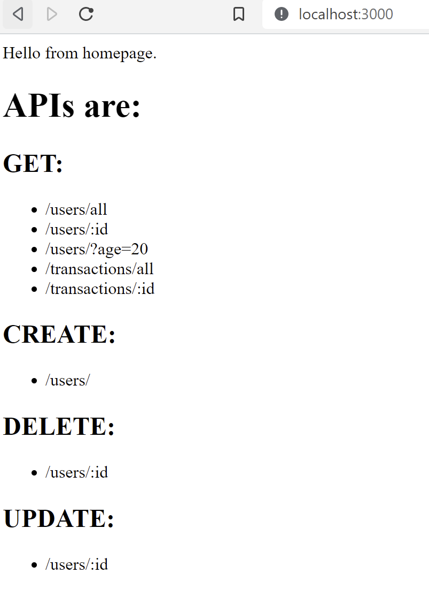

# backend-test
This is a test backend server with APIs running on port 3000 based on a tutorial
Making a small change here

The database is linked to a real Posgres database. 

Please ask me for the .env file if you want to run the code

This readme.md follows a template I sourced from 

https://dev.to/rohit19060/how-to-write-stunning-github-readme-md-template-provided-5b09

<h1 align="center"><project-name></h1>

<project-description>

## Links

- [Repo] (https://github.com/bluebloom18/NUS-Fintech-Backend-test.git "Repo")

- [Live] (https://bluebloom18.github.io/NUS-Fintech-Backend-test/ "Live View")

- [API] (https://bluebloom18.github.io/NUS-Fintech-Backend-test/ "API")

## Available Commands

Gitclone, and in the project directory, you can run:

### "npm start" 
  
## DOCKER

Create docker image: 
### docker build -t <your image name> .
### docker run -d -p 3000:3000 <your image name>

## Built With

- JavaScript
- Node
- NPM
- Docker on VS code

## Screenshot

  
## Future Updates

- Front End using React
  
## Author

**Lien Ber Luen**

- [Profile](https://github.com/bluebloom18 "Lien Ber Luen")
- [Email](mailto:lienbl@gmail.com?subject=Hi "Hi!")
- [Linkedin](https://www.linkedin.com/in/ber-luen-lien-512ba314/ "Welcome")

## 🤝 Support

Contributions, issues, and feature requests are welcome!

Give a ⭐️ if you like this project!
